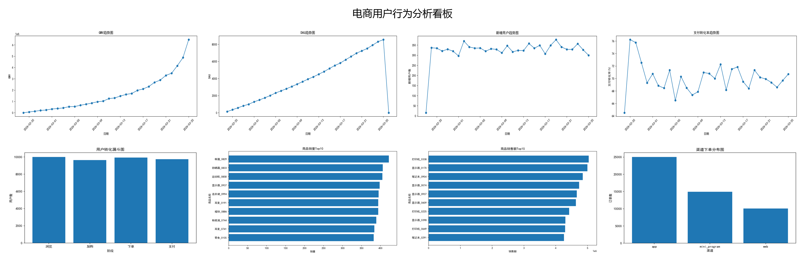

# 电商用户行为分析项目

## 1. 项目简介
本项目基于模拟电商业务数据，构建了一个完整的电商用户行为分析系统。  
项目包含数据生成、MySQL 数据落库、SQL 分层建模、核心指标统计以及 Python 可视化展示等完整流程。

通过本项目，可以实现对电商平台用户、商品、订单、支付和行为日志数据的分析，输出用户增长、用户活跃、GMV、支付转化率、商品销售 Top10、渠道分布等核心业务指标。

---

## 2. 项目目标
本项目主要实现以下目标：

- 构建模拟电商业务数据集
- 将原始数据导入 MySQL
- 基于 SQL 完成数仓分层建模（ODS / DWD / DWS / ADS）
- 统计核心业务指标
- 基于 Python 生成可视化图表
- 输出电商用户行为分析总览看板

---

## 3. 技术栈
本项目使用的主要技术如下：

- Python
- MySQL
- SQL
- pandas
- matplotlib
- SQLAlchemy
- PyMySQL
- Pillow

---

## 4. 项目分层设计

### ODS 原始层
存储原始业务数据表：

- users
- products
- orders
- order_items
- payments
- user_events

### DWD 明细层
对原始数据进行轻度清洗与宽表整合：

- dwd_orders
- dwd_user_events

### DWS 汇总层
按照用户、商品、订单等主题进行日粒度汇总：

- dws_user_day
- dws_product_day
- dws_order_day

### ADS 应用层
面向最终看板展示的指标表：

- ads_dashboard

---

## 5. 原始数据表说明

### users 用户表
记录用户基础信息：
- user_id
- username
- gender
- birthday
- city
- register_time
- register_channel
- user_level
- status

### products 商品表
记录商品基础信息：
- product_id
- product_name
- category_id
- shop_id
- price
- stock
- status
- create_time

### orders 订单表
记录订单主信息：
- order_id
- user_id
- order_time
- order_amount
- order_status
- pay_status
- source_channel
- province

### order_items 订单明细表
记录订单包含的商品明细：
- order_item_id
- order_id
- product_id
- quantity
- unit_price
- total_price
- create_time

### payments 支付表
记录支付流水：
- payment_id
- order_id
- user_id
- payment_time
- payment_amount
- payment_method
- payment_status

### user_events 用户行为表
记录浏览、加购、下单、支付等行为：
- event_id
- user_id
- product_id
- event_type
- event_time
- page_id
- source_channel
- device_type

---

## 6. 核心分析指标
本项目实现了以下核心指标分析：

- 新增用户数
- DAU（日活跃用户数）
- GMV（成交总额）
- 支付转化率
- 用户转化漏斗
- 商品销量 Top10
- 商品销售额 Top10
- 渠道下单分布
- 用户复购率

---

## 7. 可视化展示

### 电商用户行为分析总览看板



### 单图展示
项目基于 Python 自动生成以下图表：

- GMV 趋势图
- DAU 趋势图
- 新增用户趋势图
- 支付转化率趋势图
- 用户转化漏斗图
- 商品销量 Top10
- 商品销售额 Top10
- 渠道下单分布图

---

## 8. 项目目录结构

```text
.
├── README.md
├── users.csv
├── products.csv
├── orders.csv
├── order_items.csv
├── payments.csv
├── user_events.csv
├── generate_all_charts.py
├── merge_dashboard.py
├── ecommerce_dashboard.png
└── charts/
    ├── gmv_trend.png
    ├── dau_trend.png
    ├── new_user_trend.png
    ├── pay_conversion_trend.png
    ├── funnel_chart.png
    ├── product_sales_qty_top10.png
    ├── product_sales_amount_top10.png
    └── channel_orders.png